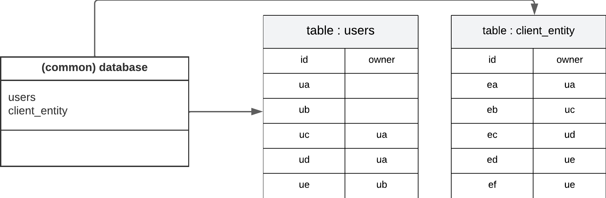
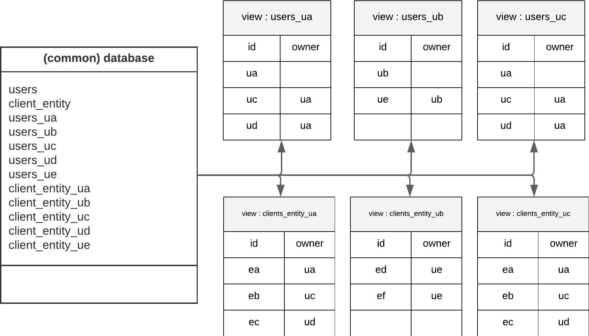
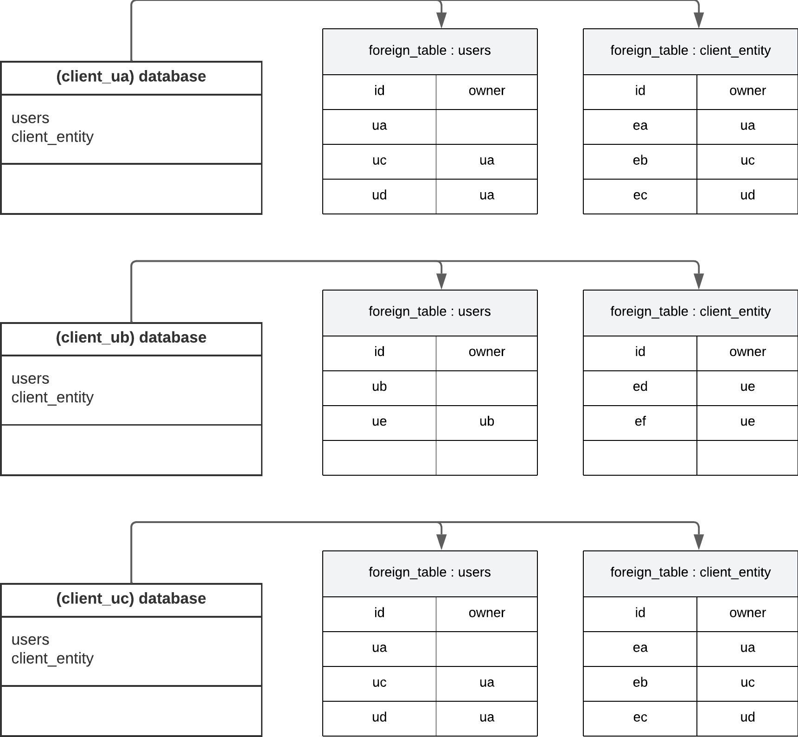
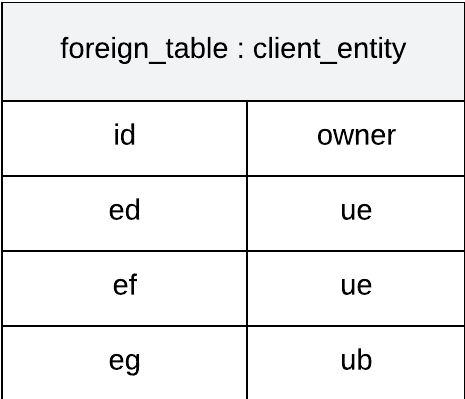

# POC - Multi Tenant

## Description 

The project's goal is to adapt the integration of doctrine in Symfony to make it work with multi tenant applications
In our case, we have a single postgresql server managing our main database and an "infinite-ish" amount of client databases

Each client database share the same schema but must be isolated from each other for privacy and security reasons   
If we have 50 clients, we want to play a doctrine migration and update each of these 50 databases easily

## App design:

### Entities
All entities are located in the default `src/Entity` folder.  
The only requirement about entities is the need of an attribute "owner_id" storing his... owner.

### Migrations
All migrations must be generated with the `bin/console doctrine:migrations:diff` command
and are located in the default `migrations` folder.

Playing this command will trigger a listener checking the result of the diff and updating clients databases if needed.

## Connection handling
Thanks to doctrine, we can manage multiple connections natively  
We've defined 2 different connections with its associated entity manager :

- Clients  
This connection has a wrapper which allow to change the current user and database of the connection.
This feature is mandatory in order to execute sql statements in the clients databases.


- Main  
This connection has the default behavior we can expect from it and is mostly (not to say only) used to play migrations.

## Database explanation
In this example, we will have users and entities.  
Entities are illustrated as a single table "client_entity" but we could have an infinity of entities tables it would be the same.



In this case, we want :

- User "ua" is able to see and manage entities from users "ua, uc, ud"
- User "ub" is able to see and manage entities from users "ub, ue"
- User "uc" is able to see and manage entities from users "uc, ua, ud"
- User "ud" is able to see and manage entities from users "ud, ua, uc"
- User "ue" is able to see and manage entities form users "ue, ub"

I will omit users "ud" and "ue" in my schema as it is the exact same as for "uc"

First thing first, we will create views of these tables for each users  
These views will be used to generate the tables in our client databases  
By using views, we can add a restriction with a "WHERE" clause in our creation statement
to limit informations shown.

Creating the view of entities for the database of "ua" would lead to:

```sql
CREATE VIEW clients_entity_ua 
AS SELECT * FROM client_entity 
WHERE id = 'ua' OR owner_id = 'ua');
```

*note: `WHERE id = 'ua'` is a trick to show himself in his `users` table*

Executing this statement for each users and each tables would result in:



At this step, we could already use it in our project by doing :
1. Create a psql user for each users able to connect on the database common
2. Limit his DQL rights on his views
3. Use the "client" connection as described above to connect on common with his user

In this scenario, all DQL statements could only be used on his views which is the result wanted.  
But, in our case, this leaves us with two problems:

1. `FROM` clause in our statement would need to change for each users as views are all
stored in the same database and contains the user's id in their name.
2. Making dump of some users data would be pain as it will require conditions on views

In order to fix these problems, we will :

1. Create a database for each users
2. Import views of users as foreign tables in this database
3. Rename foreign tables as the default tables name of common
4. Grant him rights on these foreign tables

This way, we could leave default `FROM` clause as all tables would now have the same names (generated in the migration)
and dumping data could be done easily by dumping the user's database.

We will end up with :



Now, we "simply" need to listen to the login event and change our "client" doctrine connection
to use the credentials of the logged user.

Last problem but not least : **I can create entities for any users**

A view works like this :
- A `WHERE` clause at the creation restrict what data are showed when doing a `SELECT *`
- If I can see the data, I can update or delete it
- If I can see data from a table, I can create a new data of this type

If somewhere in our code we end up having a sql injection breach, user "uc" could do something like:
`INSERT INTO client_entity(owner_id) VALUES('ub');`  
This statement would lead in creating a new entity owned by "ub" meanwhile my parent is "ua"

User "ub" would now see :   


To prevent this behavior, we will create a sql `TRIGGER` when importing foreign tables.
```sql
CREATE OR REPLACE FUNCTION override_id() RETURNS trigger as $override_id$
    BEGIN
        NEW.owner_id := 'ua';
        RETURN NEW;
    END;
$override_id$
LANGUAGE plpgsql;

CREATE OR REPLACE TRIGGER override_id_trigger
BEFORE INSERT
ON "client_entity"
FOR EACH ROW
EXECUTE PROCEDURE override_id();
```

Executing this on the database of our users linked to "ua" would override any `INSERT` statement to use his correct owner
id under any circumstances

***note :***  
As you may have notice, if a user has a child ("ua" is parent of "uc"), both databases
end up being the exact same.  

In our implementation, we use the parent database when a child logged in to prevent storing useless data that are redundant

I have voluntary added these extra data in this documentation to make it easier to understand.
